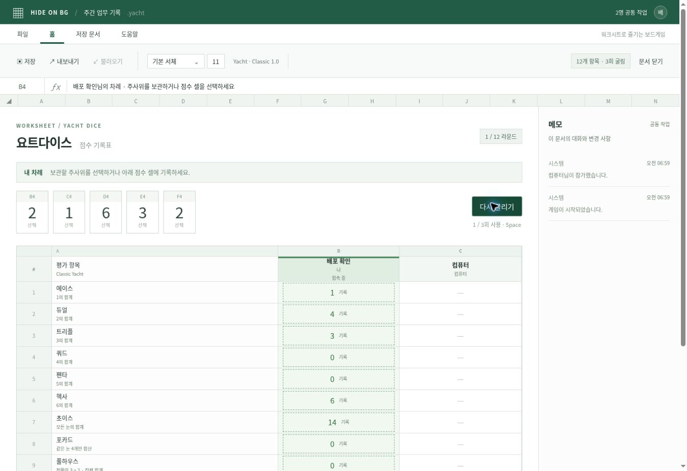

# HIDE ON BG

업무용 워크시트처럼 보이는 웹 보드게임. 첫 게임은 **고전 Yacht Dice**입니다.

**[바로 플레이](https://shinshinjin.github.io/HIDE_ON_BG/)** · [검증 결과](docs/VALIDATION.md)



## 실행

Node.js 22 이상:

```sh
npm ci
npm run dev
# http://localhost:4173
npm test
npm run build
# dist/ 정적 호스팅
```

별도 프레임워크 없이 JavaScript ES modules + CSS. 게임 엔진/점수/방 상태는 DOM과 무관한 순수 모듈입니다. PeerJS 1.5.5만 런타임 의존성이며, 빌드 시 라이브러리를 사이트에 포함합니다. CDN 장애로 혼자 하기가 중단되지 않습니다.

## 플레이

1. 닉네임 → 컴퓨터와 시작, 또는 공유 문서 만들기.
2. Host가 10자리 초대 코드를 친구에게 전달합니다.
3. 2~8명 입장, 참가자 전원 준비 → Host가 시작.
4. 주사위를 최대 3회 굴리고, 남길 주사위를 선택하고, 예상 점수가 표시된 셀에 기록합니다.
5. 12개 항목을 모두 기록하면 결과가 표시됩니다. 동점 공동 순위.
6. 메모 패널에서 채팅. Host는 자동/수동 저장, JSON 내보내기 지원.

Space: 굴리기, 1–5: 보관 변경, Tab/Enter: 셀 및 버튼 이동/선택. 모바일은 주사위 컨트롤 재배치 및 점수표 가로 스크롤을 제공합니다.

## 정확한 규칙

[docs/RULES.md](docs/RULES.md)에서 출처와 고정된 `classic-yacht-v1` 규칙을 확인하세요. **Yahtzee/닌텐도 변형과 다릅니다.** 상단 보너스 없음, 리틀은 12345, 빅은 23456, 둘 다 30점. 포카드는 같은 4개만 합산, 풀하우스는 정확히 3+2의 전체 합계. 요트 50점. 조커/추가 요트 보너스 없음.

## 멀티플레이 구조와 외부 서비스

GitHub Pages는 HTML/JS/CSS만 제공합니다. 연결 중개는 **PeerJS 공개 PeerServer Cloud**, 데이터 전송은 **WebRTC DataChannel**입니다. 큰 게임 기록도 분할 전송할 수 있도록 binary 직렬화를 사용합니다. 기본 이용에 별도 계정/API 키는 필요 없습니다. 공개 서비스의 가용성/무료 정책은 운영자에 의존합니다. 연결 실패 시 원인을 표시하며, 연결되지 않았는데 입장 완료처럼 표시하지 않습니다.

Host가 authoritative state, 참가자/준비, 주사위 CSPRNG, 점수, 턴, 채팅 순서, revision을 관리합니다. 참가자는 명령만 보냅니다. Host는 접속 인증, 차례, 굴림 횟수, 카테고리 중복, 방 인원, 메시지 길이/속도, stale revision, 중복 request ID를 검증합니다. 참가자가 보낸 주사위/점수는 무시됩니다.

**STUN/TURN:** 이 버전에 고정한 PeerJS 기본 설정에는 Google STUN 및 PeerJS의 공개 TURN 후보가 포함됩니다. 별도 계정 없이 연결을 시도하지만 서비스 가용성과 모든 방화벽/NAT 환경의 성공을 보장하지 않습니다. 실제 사용할 네트워크에서 먼저 연결 시험을 하세요. 필요하면 아래 ICE 설정에 TURN을 추가해야 하며, TURN 사업자 계정 또는 자체 서버와 인증정보가 필요합니다. 연결을 차단하는 조직의 네트워크 정책은 준수해야 합니다.

`public/network-config.json`은 공개 배포 설정입니다. 예:

```json
{
  "peerOptions": {
    "host": "your-peer-server.example.com",
    "port": 443,
    "path": "/",
    "secure": true,
    "config": {
      "iceServers": [{"urls": "stun:stun.l.google.com:19302"}]
    }
  }
}
```

기본 `{ "peerOptions": {} }`는 PeerJS 기본 공개 서비스를 사용합니다. TURN을 추가할 때 영구 비밀/API 관리 키를 이 파일이나 프론트엔드에 커밋하지 마세요. 운영용은 짧은 수명의 제한된 TURN 인증을 발급하는 작은 서버리스 엔드포인트와 갱신 로직을 붙이는 것이 적절합니다. 현재 버전에는 유료 TURN 계정/발급 서비스가 포함되지 않습니다.

공개방 검색은 미구현입니다. V1은 초대 코드 방식입니다. `RoomNetwork` 앞에 방 디렉터리 어댑터를 추가할 수 있습니다. 카메라/마이크 권한은 사용하지 않습니다.

### 연결 복구

- player ID와 무작위 재접속 token은 참가자 브라우저 localStorage에 유지됩니다.
- Host는 token 맵을 로컬 세이브에만 저장하며 전체 참가자에게 전송하지 않습니다.
- 다른 탭 중복 접속은 Web Locks와 Host의 활성 연결 검증으로 차단합니다.
- 새로고침한 참가자는 시작 화면의 재접속을 누르면 기존 슬롯을 복구합니다.
- 일시 끊김은 heartbeat 후 자동 재접속. 끊긴 참가자의 차례를 자동 소비하지 않습니다.
- Host 종료 시 게임 정지. **자동 Host migration은 하지 않습니다.** 원래 Host가 저장 문서를 열면 동일 코드/게임 상태로 복구하고 참가자들이 재연결합니다.
- 게임 중 신규 참가자는 거절. 기존 참가자만 재접속합니다.
- 대기실에서 Host는 연결 끊긴 자리를 정리할 수 있습니다. 게임 중에는 확인 후 기권 처리합니다. 기권자는 순위에서 제외되며 남은 사람이 1명이면 종료됩니다.
- Host의 브라우저 데이터가 지워지고 JSON 백업도 없으면 복구할 수 없습니다.
- Host 자체를 신뢰하는 친구 간 플레이 모델입니다. 악의적인 Host/저장 파일 소유자의 조작을 막는 검증 서버나 유료 경쟁 시스템이 아닙니다. 초대 코드는 비공개로 전달하세요.

## 저장

IndexedDB `hide-on-bg/saves`, 상태 변경마다 자동 저장. 수동 저장, 목록, 이어하기, 삭제, JSON 파일 가져오기/내보내기. 파일 버전, 룰 버전, 저장 시각, 플레이어, 현재 턴/주사위/보관 상태, 점수, 게임 로그, 메모와 재접속 인증정보가 포함됩니다. 가져오기 시 스키마와 기록 점수 재계산을 검증합니다. 최대 500KB.

JSON은 재접속 인증정보를 포함하므로 개인 보관용입니다. 브라우저 저장 차단/용량 오류는 화면에 표시되며 내보내기로 보관할 수 있습니다. 자동 저장 완료 전에 브라우저를 강제 종료하면 마지막 변경이 저장되지 않을 수 있습니다.

## GitHub Pages 배포

`.github/workflows/pages.yml`:

1. main push/PR → Node 설치 → `npm ci` → 엔진 테스트 → 실제 WebRTC 브라우저 통합 테스트 → 빌드.
2. main만 Pages artifact 업로드 및 배포. 실패한 테스트는 배포를 막습니다.
3. 저장소 Settings → Pages → Build and deployment → Source를 **GitHub Actions**로 선택하세요. 워크플로가 자동 활성화를 시도하지만 최초 활성화에 저장소 관리 권한이 필요할 수 있습니다.
4. Actions의 `Test and deploy Pages` 실행 결과와 `github-pages` 환경 URL을 확인하세요.

배포 주소: `https://shinshinjin.github.io/HIDE_ON_BG/`. 2026-09-24 배포 및 공개 환경 8인 완주 테스트 성공. 이후 실행 결과는 Actions에서 확인하세요.

관리자가 해야 할 수 있는 일: Pages 최초 활성화, 조직 정책에 의해 막힌 Actions 승인. 기본 네트워크에는 별도 계정/키가 필요 없고, 자체 signaling 또는 TURN 사용 시에만 별도 서비스 설정이 필요합니다.

## 테스트

```sh
npm test
npx playwright install chromium
npm run test:e2e
```

엔진: 전체 7,776 조합 × 12 카테고리, 잘못된 입력, 0점, 3회 한도, 보관, 턴 전환, 재선택 방지, 8인 96턴 종료, 합산/동점/기권, AI 완주, 방 권한, 저장 파일 검증.

브라우저 통합 테스트: 로컬 PeerServer를 사용하지만 실제 독립 브라우저 컨텍스트와 WebRTC 채널을 연결합니다. 혼자 한 판, 8인 한 판, 모바일 너비, 채팅 escaping, 참가자 새로고침, Host 복구, 중복 탭을 검사합니다. `test-results/`에 스크린샷이 생성됩니다. 로컬 테스트는 인터넷의 NAT/공개 signaling 가용성을 증명하지 않습니다.

배포 환경 추가 검증: `E2E_BASE_URL=https://shinshinjin.github.io/HIDE_ON_BG/ E2E_CLOUD=1 npm run test:e2e`. 실제 iPhone Safari/Android 단말 및 다른 인터넷 회선의 검증 여부는 [docs/VALIDATION.md](docs/VALIDATION.md)에 구분해 기록합니다.

## 폴더 구조 / 게임 확장

- `src/core/room.js` — 공통 방/준비/채팅/명령 권한
- `src/core/network.js` — PeerJS transport, 인증, 재접속, 동기화
- `src/core/storage.js` — IndexedDB와 파일 검증
- `src/games/registry.js` — 게임 정의 등록
- `src/games/yacht/` — scoring, engine, AI
- `src/ui/` — 스프레드시트 화면과 반응형 CSS
- `src/app.js` — 화면/저장/네트워크 조정
- `tests/` — 규칙·방·저장·브라우저 통합
- `scripts/` — 정적 빌드 및 개발 서버

두 번째 게임은 `games/<id>`에 순수 상태 엔진을 만들고 registry에 `createGame`, `applyGame`, `forfeit`, 인원 제한, 항목을 등록합니다. 네트워크/채팅/준비 시스템은 재사용합니다. 새 게임의 UI renderer와 저장 스키마 validator도 추가해야 합니다. 현재 UI/세이브 validator는 요트 전용이며 모든 게임을 자동 지원한다고 가정하지 않습니다.

AI는 빈 항목의 기회비용을 고려한 1-step expectimax: 32개 보관 조합과 다음 굴림의 모든 결과를 평가합니다. 단순 랜덤이 아니며 전체 게임 최적 전략을 보장하지 않습니다.
